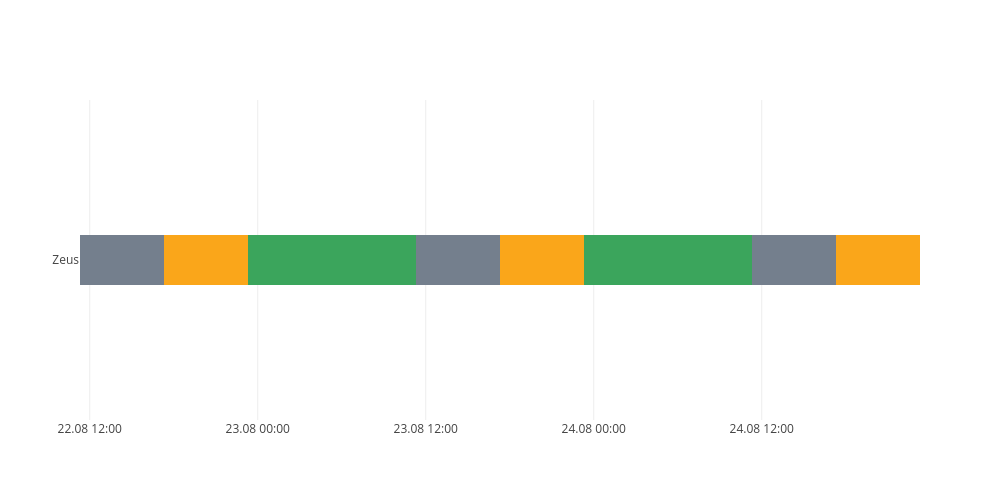

# stalker-conan
stalker-conan is a discord bot that monitors the activity of users inside of guilds.

Create activity graph using /graph [user] (optinal [user]).

# Example /graph @Zeus

# Setup
## Database
This bot requires a postgress database to be setup using the schema in [sql/create_database.sql](sql/create_database.sql).

## Plotly
Graphs are created using [plotly.js](https://github.com/plotly/plotly.js).

## Configs
Config files have to be created in [src/configs](src/configs).
The files required are:
1. db.json
2. discord.json
3. plotly.json
## Exmaples
### db.json

`{
    "host": "********.compute.amazonaws.com",
    "user": "some_user",
    "port": 5432,
    "password": "some_password",
    "database": "some_database",
    "ssl": {
        "rejectUnauthorized": false
    }
}`
### discord.json
`{
    "token": "**************************************************",
    "id": "123456123456123456"
}`
### plotly.json
`{
    "username": "some_username",
    "api_key": "some_api_key"
}`